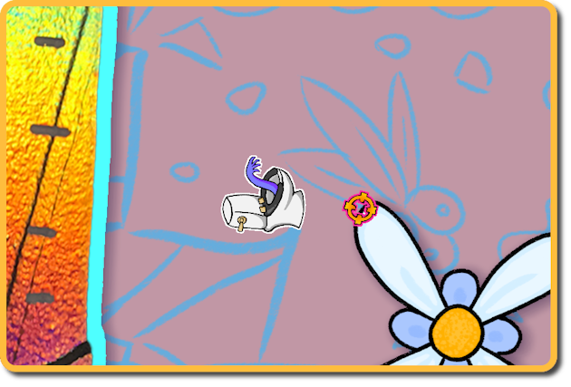
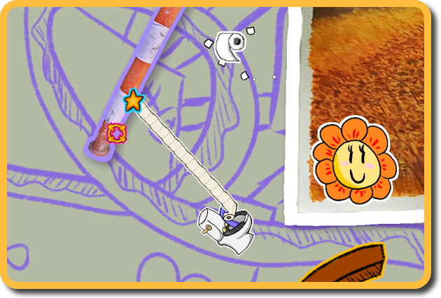
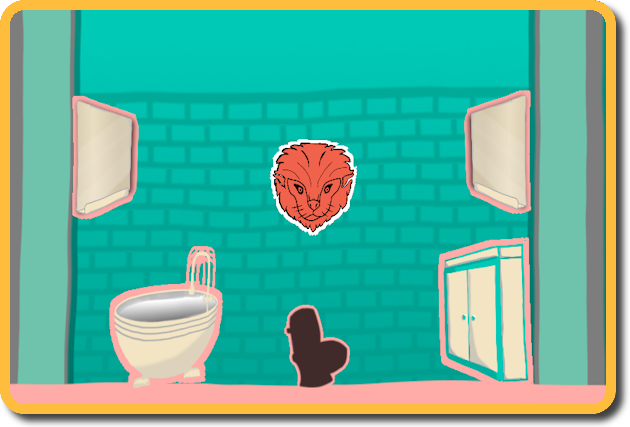
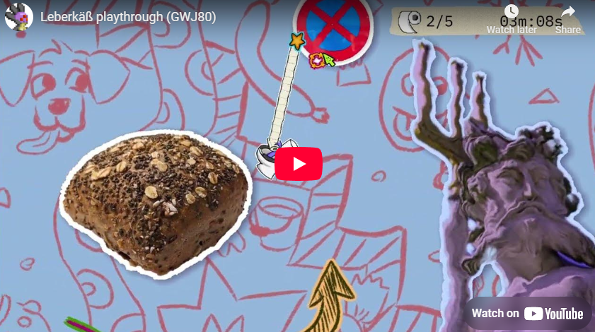

# Leberkäß - A foddian platformer made with Godot for the Godot Wild Jam #80
Link to the game: https://misterixi.itch.io/leberkaes  
Link to the jam: https://itch.io/jam/godot-wild-jam-80

Leberkäß is a cozy Foddian platformer experience,
a game, for wonderful people who strive for challenges.

## Gameplay:
**Move and Target** use A and D button to move and LMB (left mouse button) to shoot your toilet paper

## Swinging:
hold Left Mouse Button  -LMB- to swing

## Goal:
Swing across all objects to find the bathroom

# Link to a playthrough:
https://youtu.be/_AvsdQ7JknE

# Credits:
**Sazzles**: 2D Art, Shader, Sound  
**naddelxD**: Sound, Programming, UI  
**Steffen Winternheimer**: Leveldesign, Gamesesign, Programming  
**OliPohl**: Programming (persistence management), UI  
**Robert Mögenburg**: Programming (leaderboard), UI  
**MisterIXI**: Programming (main mechanic), Gamedesign  